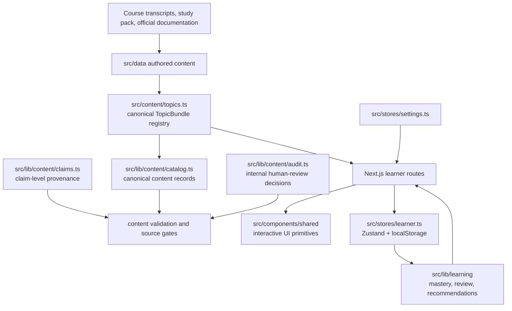
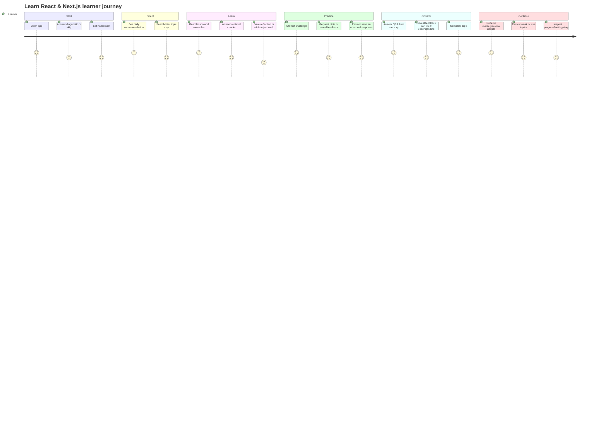

# Learn Next project schema

This document describes the project as it exists now, from two angles:

1. the implementation tree and ownership boundaries;
2. the learner's experience from first visit through review and progress.

## System shape



## Repository tree

```text
learn-next/
├── src/
│   ├── app/                         # Next.js App Router entry points
│   │   ├── page.tsx                  # first-visit diagnostic/onboarding flow
│   │   ├── onboarding/page.tsx       # alias to the onboarding flow
│   │   ├── home/page.tsx             # dashboard, recommendation, topic map
│   │   ├── topic/[slug]/page.tsx     # Learn → Practice → Confirm topic loop
│   │   ├── review/page.tsx           # focused review session
│   │   ├── progress/page.tsx         # mastery map, weak spots, activity
│   │   ├── settings/page.tsx         # profile, accessibility, data controls
│   │   ├── design-system/page.tsx    # internal visual/component reference
│   │   ├── not-found.tsx             # unknown route/topic fallback
│   │   ├── layout.tsx                # metadata, global CSS, app shell
│   │   └── globals.css               # tokens, utility classes, responsive UI
│   │
│   ├── components/
│   │   ├── layout/AppLayout.tsx      # desktop sidebar, mobile navigation, shell
│   │   └── shared/                   # reusable learner-facing UI
│   │       ├── Accordion.tsx
│   │       ├── ChallengeAnswerForm.tsx
│   │       ├── CodeBlock.tsx
│   │       ├── KnowledgeCheckForm.tsx
│   │       ├── LessonExtras.tsx
│   │       ├── MasteryBadge.tsx
│   │       ├── ProgressBar.tsx
│   │       ├── SearchBar.tsx
│   │       └── SourceAttribution.tsx
│   │
│   ├── content/
│   │   ├── topics.ts                # canonical TopicBundle registry
│   │   └── topic-loop-content.ts     # compatibility export for sparse-topic drafts
│   │
│   ├── data/                         # authored curriculum records
│   │   ├── topics/                   # topic-owned lesson, challenge, Q&A, practice modules
│   │   ├── lessons.ts                # compatibility lesson export
│   │   ├── challenges.ts             # compatibility challenge export
│   │   ├── qa.ts                     # compatibility Q&A export
│   │   ├── best-practices.ts         # compatibility practice export
│   │   ├── expansion.ts              # focused curriculum additions
│   │   ├── curriculum.ts             # topic-family labels and curriculum metadata
│   │   ├── learn-react-bridge.ts     # sibling-course deep-dive bridge
│   │   ├── learn-react-challenge-bridge.ts
│   │   └── learn-react-qa-bridge.ts
│   │
│   ├── lib/
│   │   ├── content/                  # content identity, trust, and audit plane
│   │   │   ├── identity.ts           # typed lesson/challenge/QA/practice IDs
│   │   │   ├── catalog.ts            # normalized canonical catalog projection
│   │   │   ├── claims.ts             # exact claim + source ledger
│   │   │   ├── audit.ts              # internal human-review matrix/statuses
│   │   │   ├── validate.ts            # source metadata validation
│   │   │   ├── inventory.ts           # legacy/source inventory checks
│   │   │   └── source-links.live.test.ts
│   │   ├── learning/                 # learner model and adaptation rules
│   │   │   ├── types.ts              # UnifiedProfile and learning event types
│   │   │   ├── mastery.ts             # mastery/confidence updates
│   │   │   ├── adaptation.ts          # review queue and event handling
│   │   │   ├── recommendations.ts    # next-topic selection
│   │   │   ├── prerequisites.ts       # topic dependency checks
│   │   │   ├── challenge-adapter.ts   # authored → unified challenge shape
│   │   │   ├── daily-package.ts       # deterministic daily learning package
│   │   │   └── migration.ts           # old/sibling state → canonical profile
│   │   ├── diagnostic.ts             # onboarding level calculation
│   │   └── navigation.ts             # route/nav ownership and active state
│   │
│   ├── stores/
│   │   ├── learner.ts                # persisted learner profile/progress
│   │   └── settings.ts               # persisted accessibility preferences
│   │
│   ├── types/index.ts                # authored content and learner-facing types
│   └── middleware.ts                 # known topic-slug validation / 404 rewrite
│
├── docs/                             # internal design, review, and trust records
│   ├── project-schema.md             # this document
│   ├── content-audit-plan.md         # internal claim-review workflow
│   ├── impeccable-ui-audit.md        # UI/UX audit and implementation receipt
│   ├── curriculum/source-manifest.md # source intake and transcript anchors
│   └── review/                       # architecture, trust, content, and QA receipts
│
├── package.json                      # scripts and dependency boundary
├── next.config.js                   # Next.js configuration
├── tsconfig.json                    # TypeScript path/configuration
├── vitest.config.ts                 # test configuration
└── .github/workflows/quality.yml    # CI quality/source gates
```

Generated/runtime directories such as `.next/` and `node_modules/` are not part of the maintained architecture.

## Core data model

### Topic bundle

`src/content/topics.ts` is the runtime curriculum boundary. Each topic owns its complete learning loop:

```ts
type TopicBundle = {
  id: string;
  lesson: Lesson;
  challenges: Challenge[];
  qa: QAItem[];
  practices: BestPractice[];
  meta: {
    topicFamily: TopicFamily;
    level: Level;
    title: string;
  };
};
```

The registry prevents lessons, challenges, Q&A, and practices from becoming competing topic identities.

### Content trust record

`src/lib/content/catalog.ts` projects every published item into a normalized record:

```ts
type CanonicalContentRecord = {
  schemaVersion: 1;
  id: string;
  kind: 'lesson' | 'challenge' | 'qa' | 'practice';
  slug: string;
  title: string;
  topicId: string;
  topicFamily?: TopicFamily;
  level?: Level | number;
  tags: string[];
  sourceMetadata: SourceMetadata[];
};
```

### Claim and audit record

`src/lib/content/claims.ts` stores the evidence contract for technical claims:

```text
claimId
contentId
exact claim
source URL and type
framework/library version
last verified date
what the source supports
what it does not support / conflict boundary
confidence
```

`src/lib/content/audit.ts` adds the separate human decision:

```text
claimId
status: pending | verified | needs-revision | deprecated
reviewer
reviewedAt
reviewNotes
```

This audit plane is internal. It is not rendered in learner routes.

### Learner profile

`src/stores/learner.ts` persists the canonical `UnifiedProfile` in the browser:

```text
identity: name, level, goals, focus area
diagnostic: answers and completion state
learning state: lesson progress, topic stage, challenge attempts
mastery: mastery, confidence, mistakes, attempts, review dates
adaptation: review schedule, manual-review flags, learning events
motivation: completed topics, earned capabilities, streak
```

`src/stores/settings.ts` persists reduced motion, contrast, and font-size preferences separately.

## Learner journey



### Route responsibilities

| Route | Learner purpose | Main state/content dependencies |
| --- | --- | --- |
| `/` | Welcome, diagnostic, level/path setup | diagnostic rules, learner store |
| `/onboarding` | Same onboarding flow from deep links/settings | root onboarding flow |
| `/home` | Daily next step, review due, topic discovery | topic bundles, catalog, recommendations, learner store |
| `/topic/[slug]` | Complete one topic loop | bundle, prerequisites, challenge/QA forms, learner store |
| `/review` | Focused retrieval for due/weak/manual topics | review queue, mastery, topic bundles |
| `/progress` | Inspect mastery, weak spots, recent activity | learner profile, topic bundles, learning events |
| `/settings` | Change path/accessibility and export/import/reset data | learner/settings stores, migration |
| `/design-system` | Internal visual reference | shared styles/components |

## Topic loop behavior

```text
Learn
  lesson sections
  code/examples/diagrams
  retrieval chunks and reflection
        ↓
Practice
  1–3 challenge records
  scored or unscored response
  hints, feedback, attempt persistence
        ↓
Confirm
  up to 5 Q&A records
  answer → reveal → confirm understanding
        ↓
Complete
  mastery/confidence update
  streak/event update
  next review schedule
```

Prerequisites can prevent entry to a topic until required topics reach the configured mastery threshold. Progress is resumed from the persisted topic stage after hydration.

## Ownership boundaries

| Concern | Owner | Not owned by |
| --- | --- | --- |
| Published topic composition | `src/content/topics.ts` | individual route files |
| Authored lesson/challenge/Q&A/practice text | `src/data/topics/` | learner store |
| Stable content identity | `src/lib/content/identity.ts` | display titles |
| Source/claim provenance | `src/lib/content/claims.ts` and `catalog.ts` | learner UI state |
| Human content approval | `src/lib/content/audit.ts` | learner-facing routes |
| Mastery and review state | `src/stores/learner.ts` + `src/lib/learning/` | content records |
| Accessibility preferences | `src/stores/settings.ts` | curriculum data |
| Route validity | `src/middleware.ts` and topic registry | UI links alone |
| Visual consistency | `globals.css`, shared components, design-system route | content data |

## User-visible vs internal-only

### Learner-visible

- lessons, code examples, diagrams, challenges, Q&A, practices;
- progress, mastery, review recommendations, streaks;
- accessibility controls and local data export/import;
- source attribution links shown on learning content.

### Internal-only

- claim IDs and audit rows;
- reviewer decisions and review notes;
- source-intake transcripts, study-pack mappings, and collision matrices;
- catalog validation reports and live source checks;
- implementation receipts and UI/content audit documents.

## Current platform limits

- No backend, accounts, server database, payments, or remote learner sync.
- Learner progress and settings are browser-local.
- The React course study pack informs discovery and topic selection; raw transcript text is not the runtime content authority.
- Official React, Next.js, MDN, WAI, OWASP, and library documentation back published technical claims.
- Human claim-review decisions are modeled but not yet populated; this does not block development or normal build/test gates.
- Tailwind, Styled Components, Supabase, React Hook Form, and legacy Pages Router remain comparison/deferred scope.

## Verification surface

```sh
npm test
npm run typecheck
npm run lint
npm run build
npm run verify:sources
npm run audit:content
```

The first five commands validate the application and published content structure. `audit:content` validates the internal audit workflow; it intentionally reports claims as pending until human review entries are added.
